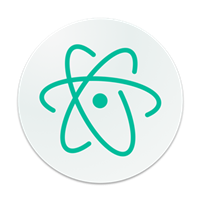

[](https://atom.io)

# Atom starter

> https://atom.io

:rocket: My favorites plugins, themes and configurations for the Atom editor. 
 
## How to use?

```sh
# Clone the project
git clone git@github.com:jjaderg/atom-starter.git ~/.atom-starter

# Access folder
cd .atom-starter

# Install preferences
apm install --packages-file packages.cson
```
## Content

### Packages:

- [Highlight Selected](https://atom.io/packages/highlight-selected)
- [Simple Drag and Drop Text](https://atom.io/packages/simple-drag-drop-text)
- [Merge Conflicts](https://atom.io/packages/merge-conflicts)
- [Color Picker](https://atom.io/packages/color-picker)
- [Emmet](https://atom.io/packages/emmet)
- [Docblockr](https://atom.io/packages/docblockr)
- [Pigments](https://atom.io/packages/pigments)
- [Linter](https://atom.io/packages/linter)
- [Autocomplete Modules](https://atom.io/packages/autocomplete-modules)
- [Auto Update Packages](https://atom.io/packages/auto-update-packages)
- [File Icons](https://atom.io/packages/file-icons)
- [Autoclose Html](https://atom.io/packages/autoclose-html)
- [Beautify](https://atom.io/packages/atom-beautify)
- [Rest Client](https://atom.io/packages/rest-client)
- [Git Control](https://atom.io/packages/git-control)
- [Tabs Exposé](https://atom.io/packages/expose)
- [Quick Editor](https://atom.io/packages/quick-editor)
- [Javascript Snippets](https://atom.io/packages/javascript-snippets)
- [Git Log](https://atom.io/packages/git-log)